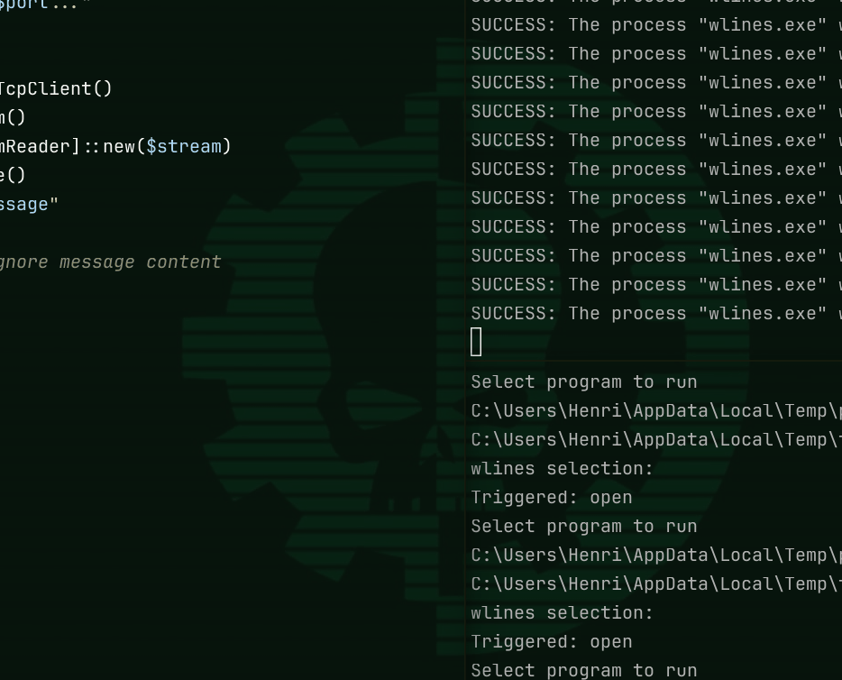

# GlazeWM-Wlines-Integration
Some scripts to connect Wlines together with Glazewm using their buillt in shortcuts and event system to send messages to a daemon launching the menu. Increasing the responsiveness of the wlines menu compared to launching a new instance of a terminal to run the script each time. 

Disclaimer: these are personal tools i made for myself so i am not intending to keep this repo clean, if it works on my end, it works. 
I also wrote these scripts out of frustration because there was no good solution online for a dmenu / rofi implementation on windows that was truly a port and not another powertoys command palette / power run copy as these never worked well for my workflow.
either having too many features all at once without seperation, slow or inresponsive, or not easily scriptable with shell scripts.

You could likely easily achieve this without glazewm but I was already using it and thought why not tie these scripts into the same environment I am intending to use it in anyway.


[showcase2](https://github.com/HenrysHouses/GlazeWM-Wlines-Integration/blob/main/2026-02-10%2002-20-13.mkv)

# Dependencies
- [GlazeWM](https://github.com/glzr-io/glazewm?tab=GPL-3.0-1-ov-file#readme)
- [Wlines](https://github.com/JerwuQu/wlines)
- PowerShell
- [jq](https://jqlang.org/)

# Getting started
I keep all my custom scritps in `C:/Users/MyUser/Bin` which is in the $PATH environment variable, if it isnt add whichever folder you decide to use.
Make sure you have both glazewm and wlines installed, and move the wlines binary into a folder in the $PATH variable. I place it in the user/bin for convenience.
You can launch the daemons however you like, I opted to do so through glazewm's startup commands listening to glaze events isnt required when its not running. you can also add these scritps to the shutdown command to make sure they dont linger if glazewm shuts down.

```yaml
  startup_commands: [
    'shell-exec yasb',
    'shell-exec --hide-window pwsh.exe -NoProfile -File "C:/Users/MyUser/bin/pwsh-daemon.ps1"',
    'shell-exec C:\Users\MyUser\Autohotkey\WinReplace.ahk',
    'shell-exec C:\Users\MyUser\Autohotkey\CapsReplace.ahk',
    'shell-exec --hide-window pwsh.exe -NoProfile -File "C:/Users/MyUser/bin/glaze-event-listener.ps1"',
  ]
```

In your glazewm config located at `C:/Users/MyYser/.glzr/glazewm/config.yaml` create a new binding mode named `wlines`. This will act as the custom event our scripts are listening to. I recomend to leave it with to keybinds other than exiting the binding mode. Doing so will also control closing the wlines menu.

```yaml
binding_modes:
  - name: 'wlines'
    keybindings:
      - commands: ['wm-disable-binding-mode --name wlines']
        bindings: ['ctrl+space', 'escape']
```
Next add a keybind to trigger entering the binding mode.

```yaml
keybindigs:
  - commands: ['wm-enable-binding-mode --name wlines']
    bindings: ['ctrl+space']
```
Lastly you likely should add wlines to the ignore window_rules section just to make sure it does not behave in any unexpected ways.

```yaml
window_rules:
  - commands: ['ignore']
    match:
      - window_process: { equals: 'wlines' }
```
